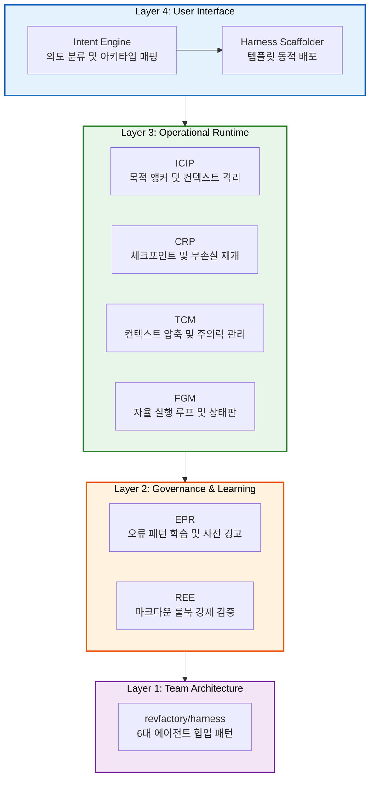

# GG-Agentic-Harness-Foundry (v1.5.0)

[]()
[]()
[]()

단순한 에이전트 프롬프트 템플릿을 넘어, **규칙 준수, 오류 방지, 장기 기억 및 자율 실행을 통제하는 "개인화된 Agentic OS 프레임워크 파운드리"**입니다.
[revfactory/harness](https://github.com/revfactory/harness)의 L3 Meta-Factory 개념을 확장하여 독자적인 8대 운영 시스템을 구축했습니다.

---

## 🏗️ 4-Layer Architecture & 8대 핵심 시스템

본 파운드리는 AI 에이전트가 단발성 대화를 넘어 거대한 프로젝트를 수행할 수 있도록 4개 계층(Layer)과 8개의 핵심 시스템으로 구성됩니다.



### Layer 4: User Interface (사용자 의도 및 진입점)
1. **Intent Engine (의도 분류 엔진)**
   - 사용자의 모호한 요청을 구조화된 형태(`Intent Object`)로 변환합니다.
   - 7개의 직업군 아키타입(Researcher, Developer, Planner 등)에 맞춰 최적의 하네스 구성을 제안합니다.
2. **Harness Scaffolder (지능형 스캐폴더)**
   - `harness-100` 베스트 프랙티스 템플릿과 연동하여 다중 플랫폼(`.gemini`, `.claude`)에 호환되는 에이전트 팀을 자동 배포합니다.

### Layer 3: Operational Runtime (런타임 실행 및 제어)
3. **ICIP (Ishikawa Context Isolation Protocol)**
   - 메인 에이전트의 컨텍스트 오염을 막기 위해 목적 앵커(`00_purpose_anchor.md`)를 불변으로 유지하고 하위 에이전트에게 분기 작업을 위임합니다.
4. **CRP (Checkpoint & Resume Protocol)**
   - 작업 단계(Phase)마다 상태를 JSON으로 기록하여 세션이 끊겨도 완벽히 이어서(Resume) 작업할 수 있게 합니다.
5. **TCM (Tiered Context Management)**
   - 대형 컨텍스트의 한계를 극복하기 위해 Soft/Hard Compaction을 수행하여 에이전트의 주의력(Attention)을 유지합니다.
6. **FGM (Foundry Goal Mode)**
   - 밤샘 구동 등 장시간 무인(Unattended) 자율 루프를 가동하여, 목적 달성 100%에 이를 때까지 스스로 검증하고 수정(Self-Correction)합니다.

### Layer 2: Governance & Learning (거버넌스 및 자가 학습)
7. **EPR (Error Pattern Registry)**
   - 작업 중 발생한 에이전트의 실수를 3계층(User/Project/Global) 레지스트리에 아카이브하고, 작업 시작 전 사전 경고(Pre-flight)를 날려 동일한 실수를 방지합니다.
8. **REE (Rule Enforcement Engine)**
   - 마크다운에 선언된 개발 표준, 룰북(`R-*.md`)을 에이전트가 강제로 준수하도록 사후 검증(Post-flight Audit)합니다.

### Layer 1: Team Architecture (기반 아키텍처)
근간이 되는 [revfactory/harness](https://github.com/revfactory/harness)의 L3 Meta-Factory 레이어입니다. 에이전트들이 상호작용하는 근본적인 뼈대를 제공합니다.
- **6 Architectural Patterns**: Pipeline, Fan-out/Fan-in, Expert Pool, Producer-Reviewer, Supervisor, Hierarchical 패턴을 기반으로 복잡한 문제를 해결할 수 있는 에이전트 팀 구조를 설계합니다.
- **기반 구성요소**: 에이전트 정의(Agents), 스킬 생성(Skills), 오케스트레이터(Orchestrators) 템플릿을 제공하여 상위 레이어의 지능적 통제를 받습니다.

---

## 💡 핵심 철학 (Design Philosophy)

- **Zero-Drift Policy (무결점 헬스체크)**: `/health-check` 커맨드 입력 시, 단순 통독이 아닌 **다중 패스 매트릭스 검증(Multi-Pass Matrix Validation)**을 수행하여 버전 불일치나 파생 모순을 100% 기계적으로 차단합니다.
- **Agent-First CLI Synergy**: 사람이 아닌 **"에이전트가 직접 읽고 실행하기 위한"** 명령어 체계를 내장했습니다. 에이전트는 환각이나 길잃음 현상이 발생하면 스스로 `/attention`, `/health-check` 등의 스킬을 호출하여 자가 치유합니다.
- **방어적 설계 (Defense-in-Depth)**: JSON 스키마 강제, 반박 논리(Rebuttal) 주입 등을 통해 에이전트가 대충 결과를 합리화하려는 것을 원천 봉쇄합니다.

---

## 🚀 설치 및 확인 방법

### 1. 환경 구성
Windows PowerShell 환경에서 제공된 설치 스크립트를 실행하여 파운드리를 대상 플랫폼(Gemini, Claude, OpenAI)에 배포합니다.

- **전역(Global) 설치**: 내 PC의 모든 프로젝트에서 사용할 경우
  ```powershell
  .\install.ps1
  ```
- **로컬(Project) 설치**: 특정 프로젝트 폴더 내부에만 종속시켜 사용할 경우
  ```powershell
  .\install-local.ps1
  ```

### 1-1. 복구 및 롤백 (Rollback)
설치 과정에서 덮어쓰기를 방지하기 위해 생성된 `백업본`으로 시스템을 원상복구할 수 있습니다. 롤백 시 현재 문제가 있는 설치본은 `_corrupted_...`로 안전하게 격리됩니다.
- **전역 복구**: `.\restore.ps1`
- **로컬 복구**: `.\restore-local.ps1`

### 2. 버전 및 정보 확인
현재 설치된 파운드리의 구성 사양과 버전(`v1.5.0`), Gemini 엔진 최적화 정보를 보려면 터미널에서 아래 스크립트를 실행합니다.
```powershell
python ./systems/foundry-info/foundry_info.py
```

### 3. Agentic Commands
채팅창에서 아래의 커맨드를 입력하여 파운드리의 내장 시스템을 직접 가동할 수 있습니다. 이는 에이전트가 자가 치유를 위해 스스로 호출하는 데에도 최적화되어 있습니다.

| 명령어 | 연결 시스템 | 핵심 기능 및 역할 | 사용 시점 |
|--------|------------|-----------------|---------|
| `/health-check` | 전역 검증 | 코드베이스 및 명세 간 논리적 모순을 전수 검사하여 Zero-Drift 보장 | 무결성 점검 시 |
| `/attention` | ICIP / REE | 작업의 본래 목적과 제약사항, 규정을 강제 상기시켜 궤도 이탈(Drift) 교정 | 의도에서 벗어날 때 |
| `/goal` | FGM | 성공 기준을 100% 달성할 때까지 무인(Unattended) 자율 실행 루프 가동 | 복합·장기 작업 시 |

---
*GG-Agentic-Harness-Foundry — Empowering AI with Memory, Rules, and Unattended Execution.*
